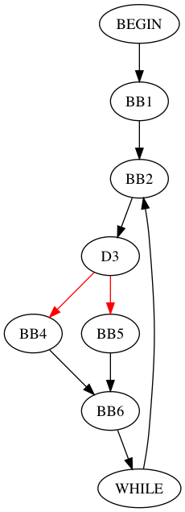

## SymTest

SymTest is a test generation tool using symbolic testing and graph algorithms to generate efficient test sequences for embedded software systems.

### Reference:
[Chakrabarti, Sujit, and S. Ramesh. "Symtest: A framework for symbolic testing of embedded software." Proceedings of the 9th India Software Engineering Conference. ACM, 2016](https://dl.acm.org/citation.cfm?id=2856642)


## Dependencies
* Install [Gradle](https://gradle.org/install/).
* Install the [Yices2 Solver](http://yices.csl.sri.com/) for your platform.
* Install [GraphViz](http://www.graphviz.org/Download.php) for CFG Visualization.


## Setting up the project

Set up the relevant path variables in `src/configuration/SymTestConfiguration.java`. 

All source programs are specified in a **C**-like language called [Cymbol](https://github.com/hqt/ANTLR-Project/blob/master/bin/com/cymbol/Cymbol.g4). The source programs are present in the `test_programs` folder. The target edges for SymTest are specified using a combination of line number and one letter code as follow:
```
Format:
<line# of if statement>-I/E/B

I - Target edge set should include the then part of if.
E - Target edge set should include the else part of if.
B - Target edge set should include both the then and else parts of if.

Eg:
21-I
22-F
```
The targets are to be specified in a file with the same name as the source with a `.target` extension.

The project can be built & executed with 
```
gradle build
java -jar build/libs/symtest-2.0-all.jar ./src/main/test/test_programs/Sample.cymbol
```

## Input
SimpleInput.cymbol
```
void main() {
	int x = 5;
	while(1) {
		int v1 = input();
		int v2 = input();
		if ((v1 > 15) && (v2 < 20)) {
			v1 = 10 + 20;
		} else {
			v1 = 1 + 2;
		}
	}
}
```

SampleInput.cymbol.target
```
6-B
```

### Output

```

...
...
path predicate = ((true AND ((symvar1588686316 > 15) AND (symvar85457716 < 20))) AND ( not ((symvar2035473512 > 15) AND (symvar96701293 < 20))))
Yices output = sat
(= symvar2035473512 0)
(= symvar1588686316 16)
(= symvar96701293 0)
(= symvar85457716 19)

solver result = satisfiable
(symvar96701293, 0)
(symvar2035473512, 0)
(symvar85457716, 19)
(symvar1588686316, 16)
Test Sequence = variable 'v1' = {16, 0, X }
variable 'v2' = {19, 0, X }

{v1=[16, 0, null], v2=[19, 0, null]}

```

## Setting up the logger (BROKEN/IGNORE)
The project uses java.util.logger to provide debug information at varying granularity. The logging levels can be controlled by using `src/logging.properties` file. To tell the compiler to use the properties file, do the following:
* `Run -> Run Configuration -> Arguments tab`
* Paste the following into the `VM arguments:` box: `-Djava.util.logging.config.file=src/logging.properties`
